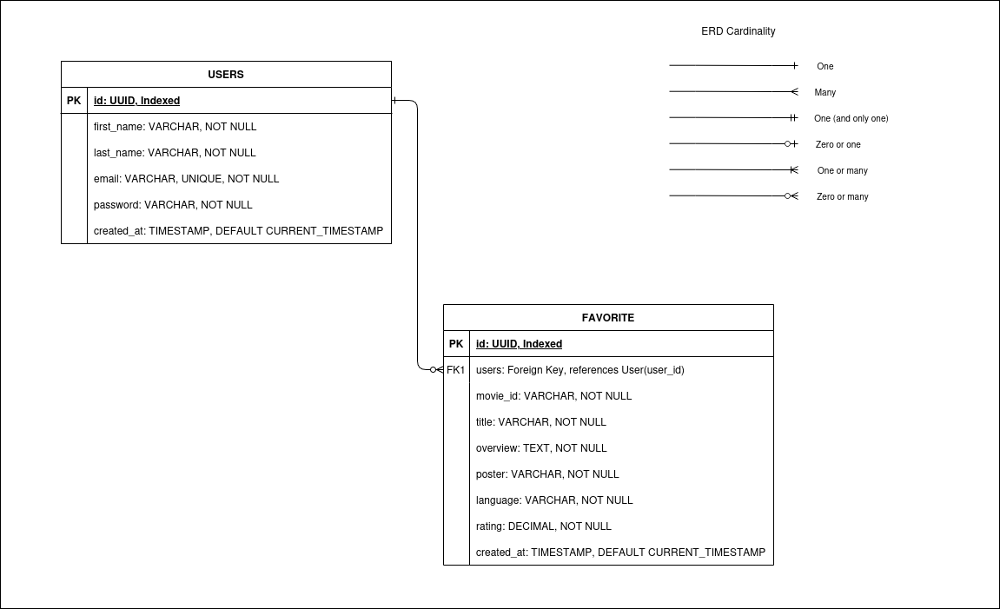

# ALX Movie Recommendation App

## Overview

This case study focuses on developing a robust backend for a movie recommendation application. The backend provides APIs for retrieving trending and recommended movies, user authentication, and saving user preferences. It emphasizes performance optimization and comprehensive API documentation.

## Project Goals

The primary objectives of the movie recommendation app backend are: - 

- **API Creation**: Develop endpoints for fetching trending and recommended movies.
- **User Management**: Implement user authentication and the ability to save favorite movies.
- **Performance Optimization**: Enhance API performance with caching mechanisms.

## Technologies Used

| **Technology** | **Purpose** |
|----------------|------------|
| Django         | For backend development. |
| PostgreSQL     | Relational database for data storage. |
| Redis          | Caching system for performance optimization. |
| JWT            | Secure role-based authentication |
| Swagger        | API documentation and testing |


## Key Features

- **API for Movie Recommendations**: 
  - Integrate a third-party movie API (e.g., TMDb) to fetch and serve trending and recommended movie data.
  - Users can save there favorite movies.

- **User Authentication and Preferences**:
  - Implement JWT-based user authentication for secure access.
  - Create models to allow users to save and retrieve favorite movies.

- **Performance Optimization**:
  - Use Redis for caching trending and recommended movie data to reduce API call frequency and improve response time.

- **Comprehensive Documentation**:
  - Use Swagger to document all API endpoints.
  - Host Swagger documentation at /api/docs for frontend consumption.


## Deployment

The backend is deployed on **Render** using **PostgreSQL** as the database.

- API URL: [https://alxprodev-movie-recommendation-backend.onrender.com/api](https://alxprodev-movie-recommendation-backend.onrender.com/api)
- Swagger Documentation: [https://alxprodev-movie-recommendation-backend.onrender.com/api/docs](https://alxprodev-movie-recommendation-backend.onrender.com/api/docs)

## Database

### Entities and Attributes

```sql
USERS

id: Primary Key, UUID, Indexed
first_name: VARCHAR, NOT NULL
last_name: VARCHAR, NOT NULL
email: VARCHAR, UNIQUE, NOT NULL
password: VARCHAR, NOT NULL
created_at: TIMESTAMP, DEFAULT CURRENT_TIMESTAMP
```

```sql
FAVORITE

users: Foreign Key, references User(user_id)
movie_id: VARCHAR, NOT NULL
title: VARCHAR, NOT NULL
overview: TEXT, NOT NULL
poster: VARCHAR, NOT NULL
language: VARCHAR, NOT NULL
rating: DECIMAL, NOT NULL
created_at: TIMESTAMP, DEFAULT CURRENT_TIMESTAMP
```

### ER-Diagram



## API Endpoints

### 1. User Login (JWT Token Generation)

- **Endpoint**: `POST /api/users/login/`
- **Description**: Authenticates the user and returns a JWT access and refresh token.
- **Request Body**:
```json
{
  "email": "example@gmail.com",
  "password": "example_password"
}
```
- **Response Body**:
```json
{
  "access": "jwt_access_token",
  "refresh": "jwt_refresh_token"
}
``` 
- **Access Token Lifetime**: 15 minute
- **Refresh Token Lifetime**: 1 day

### 2. User Signup

- **Endpoint**: `POST /api/users/signup/`
- **Description**: Registers a new user.
- **Request Body**:
```json
{ 
    "email": "user@example.com",
    "first_name": "John",
    "last_name": "Doe",
    "password": "password123" 
}
```
- **Response Body**:
```json
{ 
    "message": "User created successfully" 
}
``` 

### 3. Refresh token

- **Endpoint**: `POST /users/token/refresh/`
- **Description**: Refresh user access token.
- **Request Body**:
```json
{
    "refresh": "<your_refresh_token>"
}
```
- **Response Body**:
```json
{
    "access": "<new_access_token>"
}
``` 

### 4. Get Trending Movies

- **Endpoint**: `GET /api/movies/trending/`
- **Description**: Fetches trending movies from TMDb.
- **Response Body**:
```json
{
    "results": [ 
        { 
            "movie_id": "123",
            "title": "Movie Title",
            "overview": "Movie description",
            "poster": "poster_url",
            "language": "en",
            "rating": 8.5 
        } 
    ] 
}
``` 

### 5. Get Movie Recommendations

- **Endpoint**: `GET /api/movies/recommendations/{movie_id}/`
- **Description**: Fetches recommended movies based on a given movie ID.
- **Response Body**:
```json
{
    "results": [ 
        { 
            "movie_id": "123",
            "title": "Movie Title",
            "overview": "Movie description",
            "poster": "poster_url",
            "language": "en",
            "rating": 8.5 
        } 
    ] 
}
``` 
### 6. Save a Favorite Movie

- **Endpoint**: `POST /api/favorites/`
- **Description**: Saves a movie to the user's favorites.
- **Request Body**:
```json
{ 
    "movie_id": "123",
    "title": "Movie Title",
    "overview": "Movie description",
    "poster": "poster_url",
    "language": "en",
    "rating": 8.5 
}

```
- **Response Body**:
```json
{ 
    "message": "Movie saved as favorite" 
}
``` 

### 7. Get Favorite Movies

- **Endpoint**: `GET /api/favorites/`
- **Description**: Fetches the logged-in user's favorite movies.
- **Response Body**:
```json
[ 
    { 
        "movie_id": "123",
        "title": "Movie Title",
        "overview": "Movie description",
        "poster": "poster_url",
        "language": "en",
        "rating": 8.5 
    } 
]

``` 

### 8. Delete a Favorite Movie

- **Endpoint**: `DELETE /api/favorites/{id}/`
- **Description**: delete a movie from the user's favorites.
- **Response Body**:
```json
{
    "message": "Favorite movie deleted successfully"
}

``` 

## Environment variable

```
# Database connection
DB_NAME=''
DB_USER=''
DB_PASSWORD=''
DB_HOST=''
DB_PORT=

# Redis Location
REDIS_LOCATION=''

# Django secrete key
SECRET_KEY='

# TMDB API key
TMDB_API_KEY=''
```

## Accessing TMDB images

```
https://image.tmdb.org/t/p/original/<poster>
```